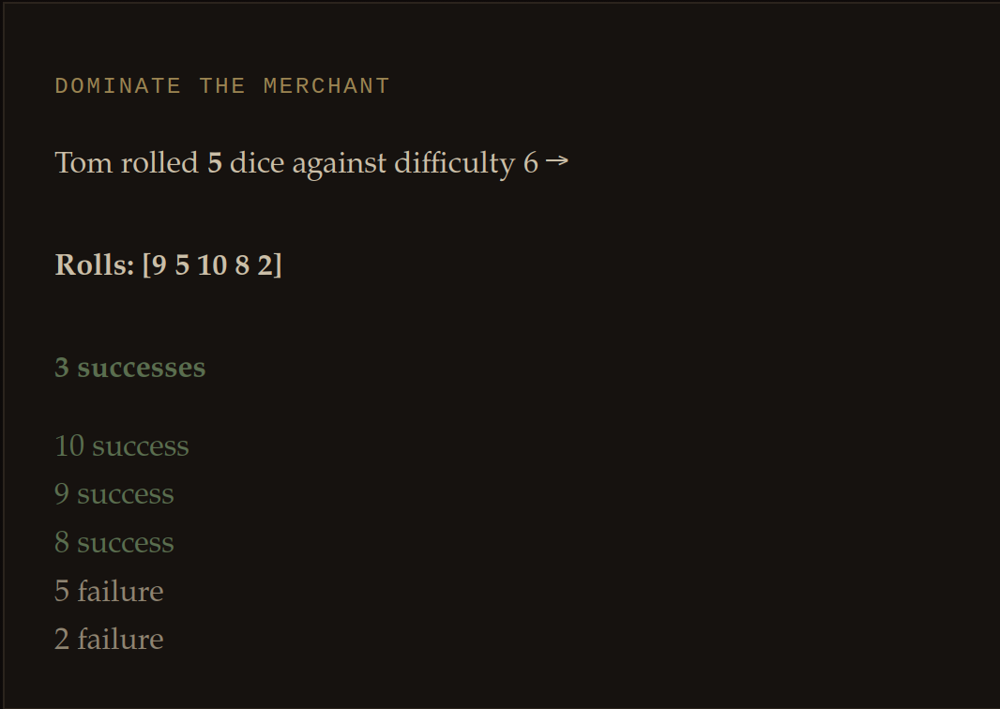
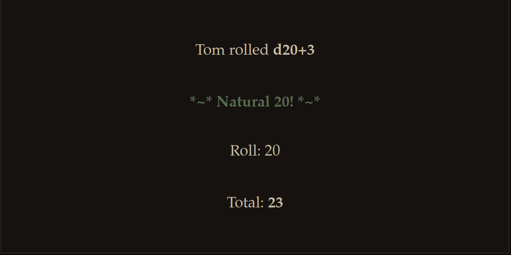
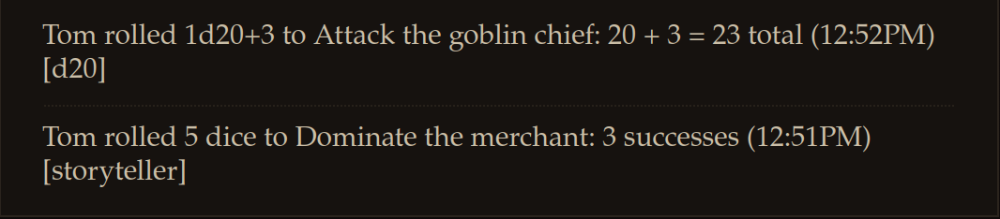
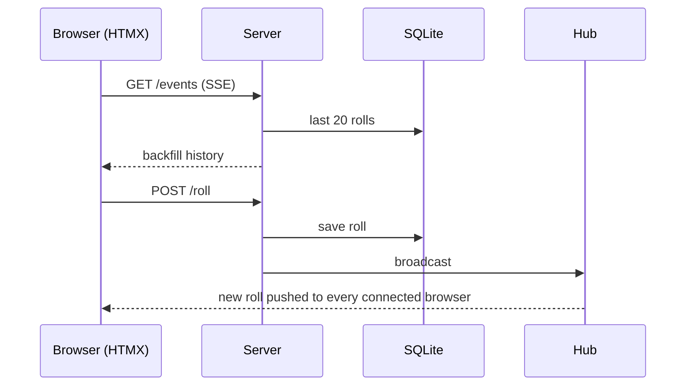

<div align="left">
  

[](https://github.com/docfrench/diceroller/actions/workflows/ci.yml) 

[](https://codecov.io/gh/docfrench/diceroller)

</div>


# Diceroller
 
Diceroller is a single page app written in Go. It rolls dice for common tabletop RPG systems (d20, d100 and Storyteller), with a live-streamed roll history shared between users.
 


 
## Features
 
- Deploys as a single Docker container with no additional dependencies
- Saves roll history in a local SQLite file
- Live-updated stream of everyone's rolls; recent rolls are backfilled from the history on page load
- Optional character name and reason on every roll, for parsing the logs later
- A table passphrase gates rolling (see [Configuration](#configuration))
### Supported systems
 
| System | What you enter |
|---|---|
| d20 | Dice notation (e.g. `1d20`) and a modifier, rolled normally or with advantage / disadvantage |
| d100 | Target percentage (1-100) and a ruleset: Delta Green or Call of Cthulhu |
| Storyteller | Dice pool (1-50) and difficulty (2-10); successes are counted and 1s cancel them |
 
### Tech stack
 
- Go, with `html/template` for rendering
- [HTMX](https://github.com/bigskysoftware/htmx) for a responsive web form without a front-end build step
- Server-Sent Events, fed by a Go hub and channels, for the live roll stream
- SQLite via the pure-Go [`modernc.org/sqlite`](https://pkg.go.dev/modernc.org/sqlite) driver, so no CGO is needed

 
## Quick start
 
```bash
git clone https://github.com/docfrench/diceroller.git
cd diceroller
docker build -t diceroller .
docker run -d --name diceroller -p 8080:8080 \
  -e TABLE_PASS=change-me \
  -v "$PWD/data:/data" \
  diceroller
```
 
Then open <http://localhost:8080>. The roll history is stored in `./data/rolls.db`, so keep the volume if you want it to survive container re-creation.
 
<!-- TODO: if you publish an image to GHCR, replace the build step with a docker pull -->
 
## Use
 
Select the dice system from the dropdown menu. Once the fields appear, complete them and click Roll.
 

 
On clicking Roll, the app rolls the requested dice and presents the formatted results. Every roll is recorded in the SQLite database. That history backfills previous rolls on page load, and it is the basis for attaching roll history to characters in an RPG campaign (see [Roadmap](#roadmap)).
 

 
Character Name and Reason are optional, but completing them makes the logs much easier to parse later.
 
## How it works
 

 
## Configuration
 
| Variable | Required | Description |
|---|---|---|
| `TABLE_PASS` | yes | Passphrase needed to roll. Don't leave it empty. |
 
The table passphrase is a simple gate check to prevent webcrawlers from rolling dice. It isn't user authentication: it gates rolling only, and the live feed and history are visible to anyone who can reach the page.
 
<!-- TODO: when the startup check is added, say the app refuses to start without TABLE_PASS -->
<!-- TODO: when a DB_PATH setting exists, document it here (the database path is currently fixed at /data/rolls.db) -->
 
## Development
 
```bash
git clone https://github.com/docfrench/diceroller.git
cd diceroller
cp .env.example .env          # set TABLE_PASS
go test -cover ./...
go run .
```
 
- Run the server from the repository root: it serves `dice.html` and `static/` from the working directory.
- The database path is currently fixed at `/data/rolls.db`, so `go run .` needs a writable `/data` directory. The tests use a temporary database and need nothing.
- A `.env` file in the working directory is loaded automatically.
- GitHub Actions runs the tests on every push and pull request and reports coverage to Codecov.
## Roadmap
 
- Attach roll history to characters in an RPG campaign
- Automatically replicate roll data into the database for the actively running campaign hosted by [deimos_api](https://github.com/docfrench/deimos_api), so roll history sits alongside the rest of the character data
## Attributions
 
Art sourced from the following:
 
- [@GDJ](https://openclipart.org/artist/GDJ)
- [DarkAthena](https://pixabay.com/users/darkathena-5167878/?utm_source=link-attribution&utm_medium=referral&utm_campaign=image&utm_content=7321982)
- [D20 icons created by Magnific - Flaticon](https://www.flaticon.com/free-icons/d20 "d20 icons")
The artwork remains under the original licenses of its sources and isn't covered by this repository's license.
 
## License
 
See [LICENSE](LICENSE).
 

